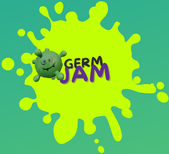
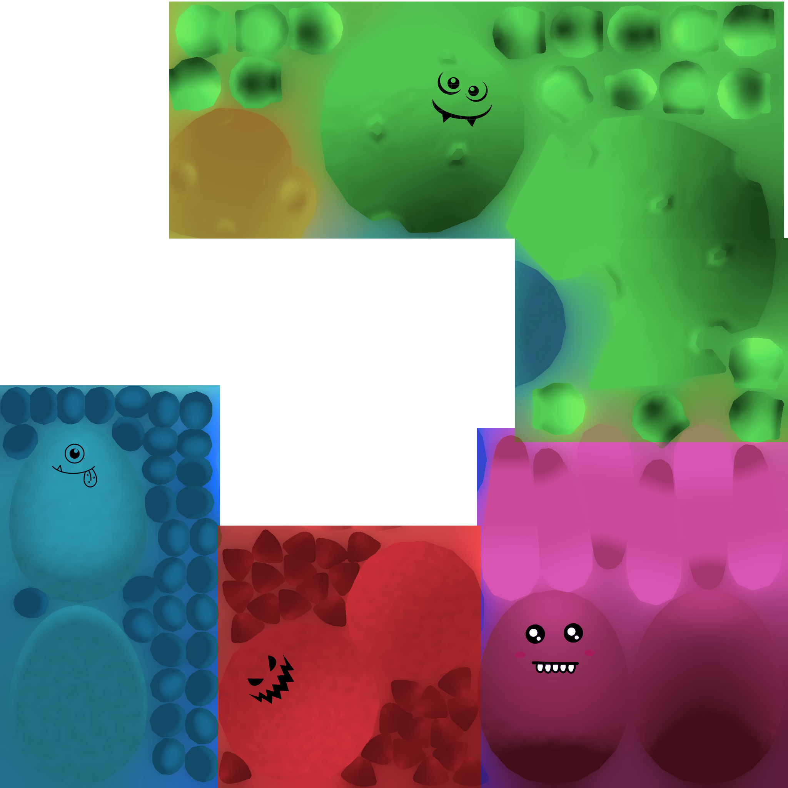

# Course Project Intro to CG

## Part 1: Improvements
The improvements we made on Assignment 1 include game juice and the overall polish of our game. This covers visual enhancements to our game, game feedback and feel, and most importantly sound effects.

To explain what we added in more detail, some additions include debris particles, environment particles, player death particles, screen shake, background music, sound effects, and a wave shader.

The falling objects in our scene play an audio cue to notify the player that an object will fall. After the object falls to the ground, debris particles are emitted from it, a sound effect is played, and the screen shakes briefly.

The environment particles and background music will be present throughout the gameplay. The particles will be emitting all around the game scene in random directions and the music will be looped.

When the player gets squished by a falling object, the player will become flat, particles will fly upwards in an explosion-like manner, and a sound effect will be played.

All of these improvements were made to refine our game and make it juicy.

## Part 2: Texturing

### Overview
The texturing was made with Adobe Substance Painter & finalized in Adobe Photoshop. The goal of the textures was to give it a silly & cartoony vibe as the game’s theme around bacteria and germs would be rather disgusting otherwise.

### Player Character Models

The design of the player character’s models were bold and simple colours that followed the colour scheme of basic bacteria colours. This would make the characters easy to identify from an orthographic view. To add to the cartoonish style, they were all given silly monster faces you would typically find in an elementary school classroom to sell that friendly and silly fun vibe. They all intend to look like silly monsters & the bright colours and goofy faces all help sell that.
Environment Textures
Texturing the environment was simpler, as those aren’t difficult to spot due to their scale, so they could be realistic. They aimed to be stylized, so they have a hue of blue to contrast better with the complimenting scenery.

### Falling Objects!

The falling objects were lightly textured as they were made with a glass shader since they tend to be made with glass and transparent textures in real life.

### Microscope

Creating the microscope involved giving it a little bit of a gritty and grainy texture, in order to make it look interesting and as previously mentioned, to contrast the scene. It was also made to have imperfections and some parts look older and wiped away, similar to how older lab equipment may look. Besides that it was made to look as realistic and proportional in order to make it feel like an appropriate playing area for the game.

### Germ Aura Particles

Lastly, the germ aura particles were textured with a transparent map made in Photoshop with a hue and consecutive transparent squares to make them look ‘shiny’ and noticeable while being small and a neat visual.

## Part 3: Visual Effects

Some of the visual effects that we added to our game include 3 different particle systems, camera shake, a glass shader, and a wave shader.

### Particles

As for the 3 particle systems, we decided to make debris, environment, and death particles.

- The debris particles create a cool effect making it look like the falling object is more destructive by sending bits and pieces of the ground flying in the air.

- The environment particles were made to create a germ-themed atmosphere, bits and pieces of bacteria float around the game scene making it feel less empty.

- The death particles made the player's death have more impact, it made it look like they truly got squished by the falling object.

When it came to implementation, all of the particle systems were children of the object that emitted the particles in the hierarchy. The parent object has a script attached that references the particle system. In some cases like the player death particles, the particle system could be triggered from the same script, but in other cases like the debris particles, 
a public method had to be called in an animation event that would trigger the particles, and the script and animator component had to be on the same game object to do so.

### Camera Shake

The camera shake was a simple but effective visual effect that enhanced our gameplay. A script was attached to the camera that would randomly move the x and y positions a defined amount over a set duration of time inside a coroutine. The method was made public to be called from other scripts, and it was used in the falling objects script to be called inside of an animation event.

This visual effect enhances our game by making the falling object feel heavy and adds impact to the fall. Otherwise, the object would not feel like it would make an impact.

### Glass Shader

The glass shader uses the 4th RGB value, alpha, and transparent render type to give any object it is applied to a glass-like look. It enhances our game by making some of the objects look like their real-life counterparts. It makes the flask, syringe, goggles, and thermometer look realistic and enhances the look of our game.

### Wave Shader

The wave shader uses sin waves to displace the vertex y position and then applies the transformation displacement position to clip space, resulting in the wave effect. Parameters like frequency, speed, and amplitude will affect the wave's end result. Frequency determines how many waves per second, speed determines how fast it goes, and amplitude determines the amount of y-position displacement.

This shader was used to imitate fluid inside of a flask. The result of this shader made the flask pop out from the rest of the objects in our scene, it looked visually stunning compared to before when it was empty.
